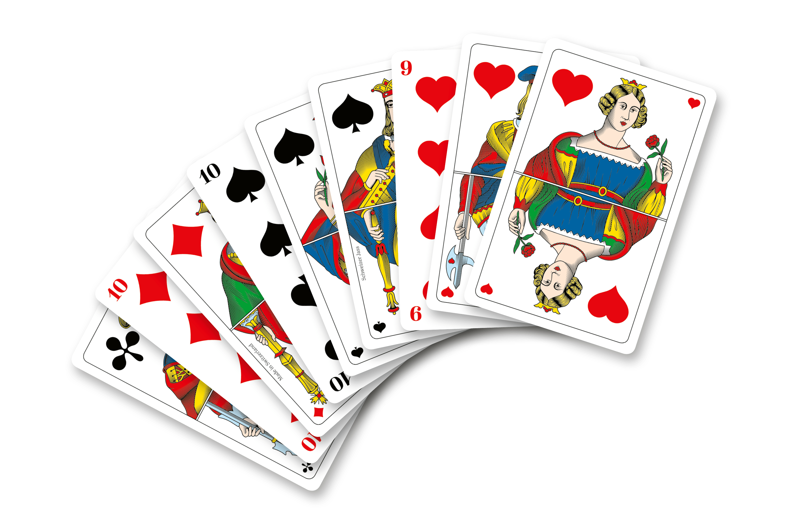

# Schieber

  

Schieber is a Swiss variant of a card game, where cards are drawn from a deck of 36 cards with 9 cards from 4 suits each. The picture above shows a selection of those cards.

### Projekt Structure

This project is loosely structured according to the [Hitchhiker's Guide to Python](https://docs.python-guide.org/writing/structure/).